## TiDB性能测试报告

### 测试环境

#### 硬件配置

在`macOS`上使用`Parallels Desktop`安装`archlinux`部署`TiDB`集群。`archlinux`的基础硬件配置信息如下:

| 组件 | 配置                                             |
| ---- | ------------------------------------------------ |
| OS   | ArchLinux (kernel: 5.8.3-arch1-1)                |
| CPU  | 8 vCPU, Intel(R) Core(TM) i9-9880H CPU @ 2.30GHz |
| RAM  | 32 GiB                                           |
| DISK | 64 GiB                                           |
| NIC  | Virtio network adapter, Shared Network           |

#### `TiDB`集群拓扑结构

使用`TiUP`在单结点上部署`TiDB`集群，考虑到本地测试环境的硬件配置有限，基于官网的[最小拓扑架构](https://docs.pingcap.com/zh/tidb/stable/minimal-deployment-topology)，配置`TiDB`的拓扑结构如下:

| 组件             | IP地址          |
| ---------------- | --------------- |
| PD * 1           | 127.0.0.1       |
| TiDB * 1         | 127.0.0.1       |
| TiKV * 3         | 127.0.0.1:20160 |
|                  | 127.0.0.1:20161 |
|                  | 127.0.0.1:20162 |
| Monitor * 1      | 127.0.0.1       |
| Grafana * 1      | 127.0.0.1       |
| AlertManager * 1 | 127.0.0.1       |

(注意：上表中的`127.0.0.1`为虚拟机的IP地址，从宿主机中访问，需要用`SNAT`映射到`10.211.55.4`。)

### 测试方案

#### 使用`TiUP`部署`TiDB`集群

#### 安装`workload`

分别使用`sysbench`, `go-ycsb`和`go-tpc`对`TiDB`集群进行性能测试。在`macOS`上可以直接使用`homebrew`安装`sysbench`，对于`go-ycsb`和`go-tpc`则需要下载源码编译安装。

#### 测试数据导入与预热

`TiDB` 使用乐观事务模型，当发现并发冲突时，会回滚事务。为了加快数据的导入，在数据导入之前，需要登录到`tidb`上，修改配置，开启事务冲突后的自动重试机制。

```mysql
set global tidb_disable_txn_auto_retry = off;
set global tidb_txn_mode = "optimistic";
```

数据导入结束之后，需要把配置改回来。

```mysql
set global tidb_disable_txn_auto_retry = on;
set global tidb_txn_mode = "pessimistic";
```

**导入`sysbench`的数据**：`sysbench`默认按照“建表->插入数据->创建索引”的顺序导入数据。按照官网提示，该方式非常耗时，需要修改`lua`脚本，调整导入顺序。直接从[这里](https://raw.githubusercontent.com/pingcap/tidb-bench/master/sysbench/sysbench-patch/oltp_common.lua)下载脚本，覆盖`/user/local/share/sysbench/oltp_common.lua`即可。

**导入`go-ycsb`的数据**：注意控制`operationcount`和`recordcount`的大小，以免导入时间过长，在本测试中，均设置为`100000`。

**导入`go-tpc`的数据**：注意控制`warehouses`的大小，以免存储空间过载，在本测试中，设置为`100`。

针对这3类workload，笔者都分别编写了脚本，放在[`bench/scripts`](https://github.com/hftsin/high-performance-tidb/tree/master/bench/scripts)目录中，可以方便数据的导入和执行性能测试。

#### 调整`TiDB`集群的配置

本测试中部署的集群硬件配置中，`CPU`只有8个，参考[`TiKV线程池优化`](https://github.com/pingcap-incubator/tidb-in-action/blob/master/session4/chapter8/threadpool-optimize.md)，可以将`TiDB`集群中`TikV`的`gRPC`并发连接数`sever.grpc-concurrency`从默认的`4`调整为`2`，对比调整前后的性能数据差异。

### 测试结果

#### 使用`sysbench`测试`TiDB`集群

分别使用8，16，32线程测试所有的benchmark，每个benchmakr运行2分钟。

基础配置的测试结果如下：

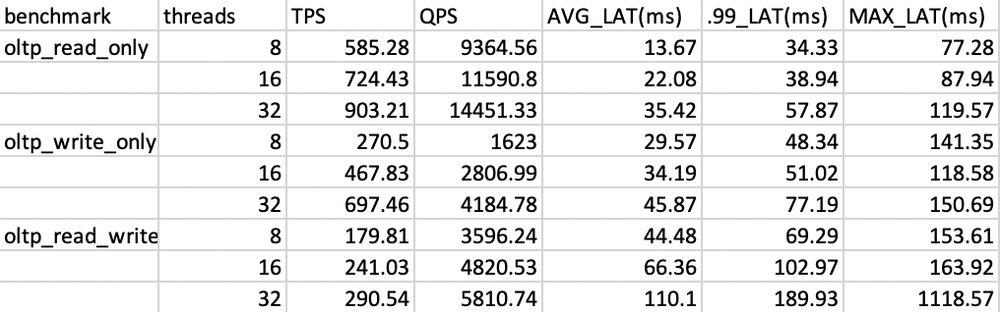

调整配置后的测试结果如下：

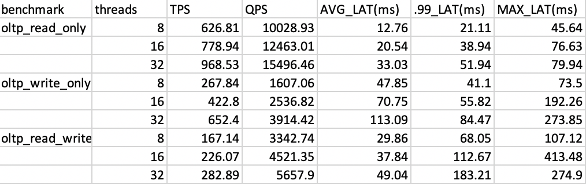


#### 使用`go-ycsb`测试`TiDB`集群

分别使用8，16，32线程测试`workload_a`, `workload_b`和`workload_c`。

基础配置的测试结果如下：

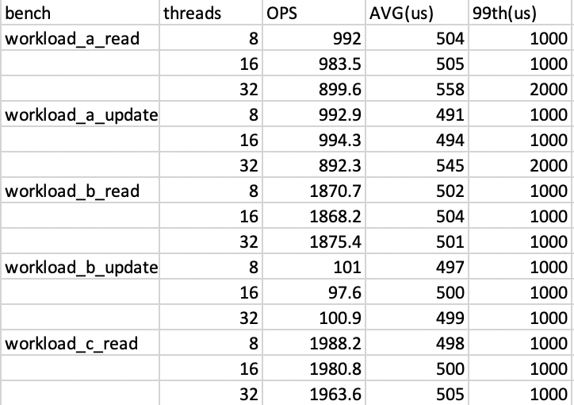


调整配置后的测试结果如下：

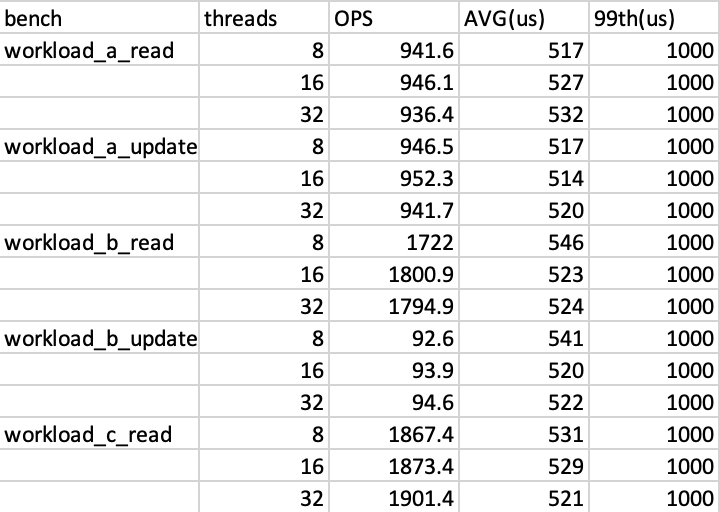


#### 使用`go-tpc`测试`TiDB`集群

分别使用4，8，16，32线程运行`tpcc`。

基础配置的测试结果如下：

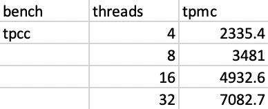

调整配置后，测试结果如下：

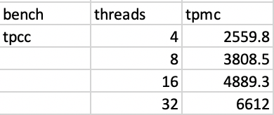

### `TiDB`性能可视化

`TiDB`提供了丰富的可视化工具用于监测系统运行时的各种指标。这里，以运行16线程的`tpcc`为例，展示在性能测试的过程中，在grafana上能够监测的各种关键的性能指标。

`TiDB Query Summary`面板中的`Duration`和`QPS`
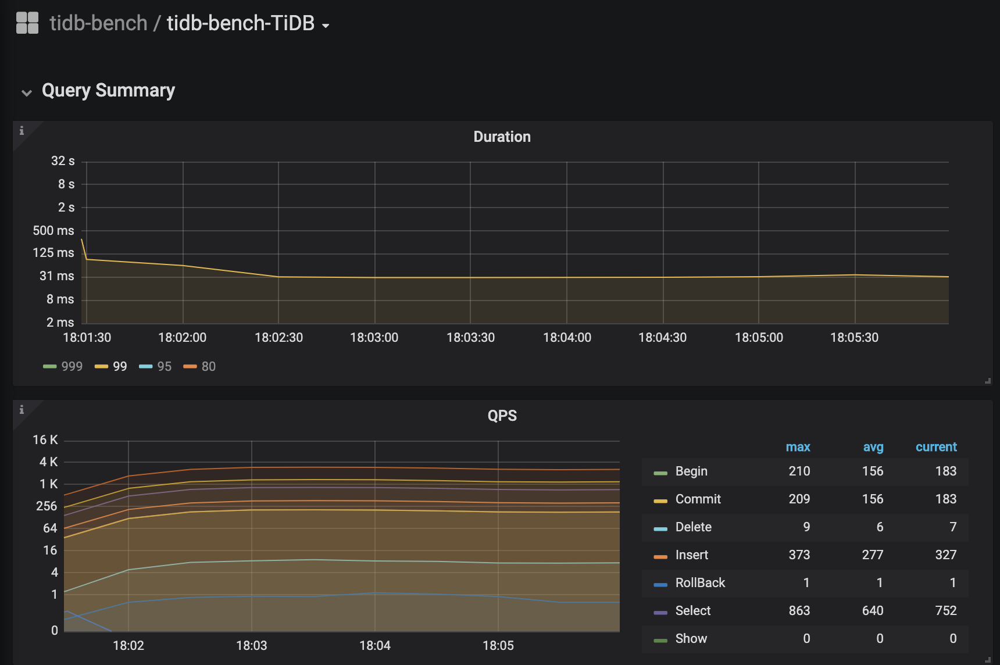

`TiKV Details - Cluster`面板中的各`server`的`CPU`及`QPS`
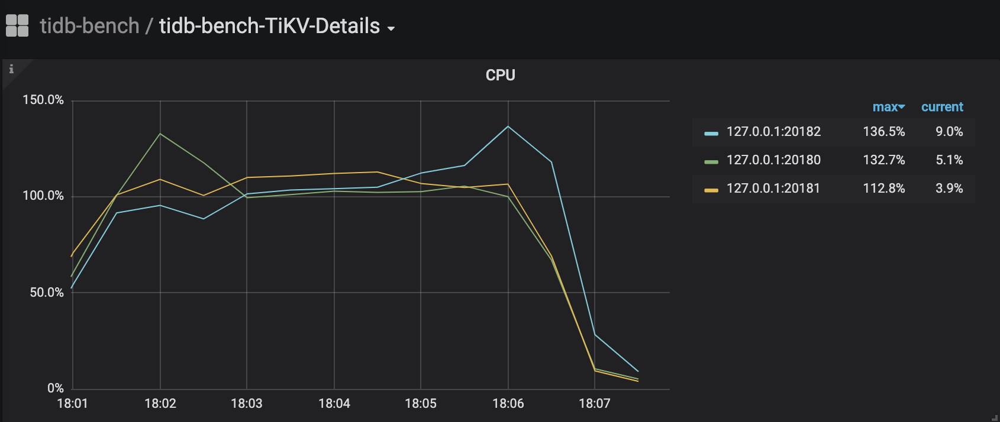

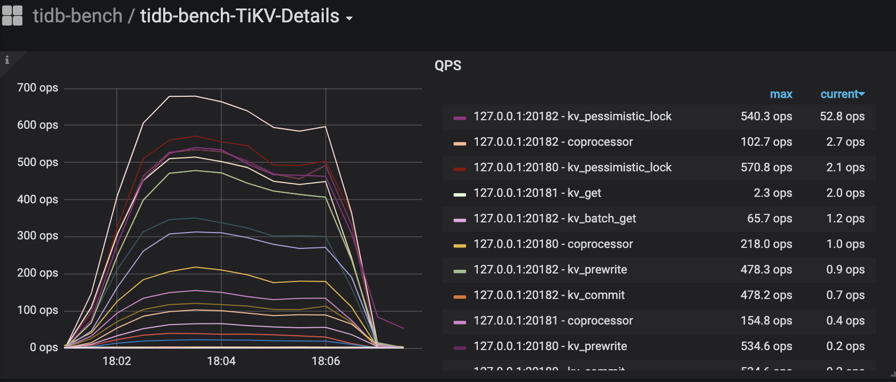

`TiKV Details - gRPC`面板中的`QPS`及`Duration`
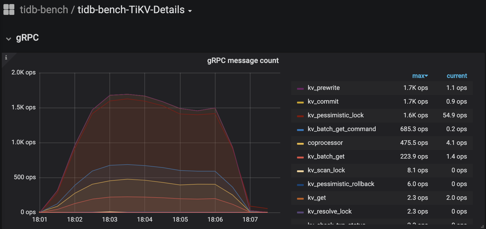

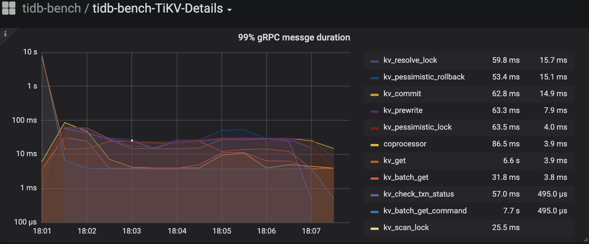

### 附录

上述测试的原始数据及日志存放于[`bench/data`](https://github.com/hftsin/high-performance-tidb/tree/master/bench/data)目录中。
